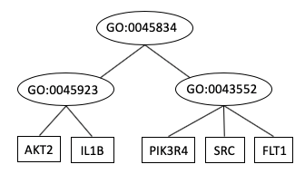

# G2PT: Mechanistic genotype-phenotype translation using hierarchical transformers

## Overview

### Motivation
Many machine learning models have been proposed that use genotype to predict various phenotypes. 
Recently, these models have focused not only on an accurate prediction but mechanistic interpretation, in that they attempt to describe the hierarchy of biological systems underlying the predicted phenotype. 
Such models still face major challenges, however, including how to robustly quantify the importance of systems mediating phenotypic outcomes and how to represent the bidirectional flow of information among genes, systems, phenotype and environment.

### Results
To address these challenges we introduce G2PT, a general Genotype-to-Phenotype Transformer, which we apply here to the classic G2P problem of modeling tumor cell sensitivity to drugs. 
We show that the framework of hierarchical transformers can represent biological systems spanning a wide range of physical scales and provide a quantitative assessment of the interplay between biological components important for phenotype prediction. 
When used to analyze a high-throughput cell screen of 436 drugs exposed to 1,097 cell types, we show that the model achieves good performance in predicting cell sensitivity for 78% of drugs (⍴ > 0.5 in cross-validation), in comparison to 55% for the recent DrugCell model. 
Attention analysis of the model identifies both known and novel molecular systems involved in drug responses, revealing for example that the response to decitabine is influenced by mutations in adherens junctions and the SUMOylation pathway. 
G2PT provides a robust and interpretable model with potential application to many challenges in genotype-phenotype translation.


## Usage

To train a new model using a custom data set, first make sure that you have
a proper virtual environment set up. Also make sure that you have all the required files
to run the training scripts:

1. Cell feature files:
    * _gene2ind.txt_: make sure you are using _gene2ind.txt_ file provided in this repository.
    * _cell2ind.txt_: a tab-delimited file where the 1st column is index of cells 
        and the 2nd column is the name of cells (genotypes).
    * _cell2mutation.txt_: a comma-delimited file where each row has 718 binary values
         indicating each gene is mutated (1) or not (0).
    The column index of each gene should match with those in _gene2ind.txt_ file. 
    The line number should match with the indices of cells in _cell2ind.txt_ file.
    * _cell2cndeletion.txt_: a comma-delimited file where each row has 718 binary values
         indicating copy number deletion (1) (0 for not).
    * _cell2amplification.txt_: a comma-delimited file where each row has 718 binary values
         indicating copy number amplification (1) (0 for not).

2. Training data file: _training_data.txt_
    * A tab-delimited file containing all data points that you want to use to train the model.
    The 1st column is identification of cells (genotypes), the 2nd column is a placeholder 
    for drug SMILES and the 3rd column is an observed drug response in a floating point number.

3. Ontology (hierarchy) file: _ontology.txt_
    * A tab-delimited file that contains the ontology (hierarchy) that defines the structure of a branch
    of a G2TP model that encodes the genotypes. The first column is always a term (subsystem or pathway),
    and the second column is a term or a gene.
    The third column should be set to "default" when the line represents a link between terms,
    "gene" when the line represents an annotation link between a term and a gene.
    The following is an example describing a sample hierarchy.

        

    ```
     GO:0045834	GO:0045923	default
     GO:0045834	GO:0043552	default
     GO:0045923	AKT2	gene
     GO:0045923	IL1B	gene
     GO:0043552	PIK3R4	gene
     GO:0043552	SRC	gene
     GO:0043552	FLT1	gene       
    ```

     * Example of the file (_ontology.txt_) is provided in _sample_ folder.
4. Pre-trained system and gene embedding
   * _nest_embedding.npy_: pretrained numpy dictionary file for system. System names must correspond to _sys2ind.txt_
   * _gene_embedding.npy_:pretrained numpy dictionary file for gene. Gene names must correspond to _gene2ind.txt_
   * if embeddings are not provided, model will learn embedding by itself.


There are several optional parameters that you can provide in addition to the input files:

1. _--out_: a name of directory where you want to store the trained models. The default
is set to "MODEL" in the current working directory.

2. _--hiddens_: a embedding dimension size

3. _--compound_hiddns_: a number of neurons to assign each subsystem in the hierarchy.

4. _--epochs_: the number of epoch to run during the training phase. The default is set to 300.

5. _--batch_size_: the size of each batch to process at a time. The deafult is set to 5000.
You may increase this number to speed up the training process within the memory capacity
of your GPU server.

6. _--lr_: Learning rate. Default is set 0.001.

7. _--wd_: Weight decay. Default is set 0.001.

8. _--cuda_: the ID of GPU unit that you want to use for the model training. The default setting
is to use GPU 0.


```
                  
usage: train_model.py 
                      --onto ONTO
                      --subtree_order
                      --train TRAIN --val VAL --test TEST
                      
                      --nest_embedding NEST_EMBEDDING
                      --gene_embedding GENE_EMBEDDING
                      
                      --epochs EPOCHS
                      --lr LR
                      --wd WD
                      --batch_size BATCH_SIZE
                      --dropout DROPOUT
                      --val_step VAL_STEP
                      --jobs JOBS
                      
                      
                      --cuda CUDA
                      
                      --hidden_dims HIDDEN_DIMS
                      --compound_layers COMPOUND_LAYERS [COMPOUND_LAYERS ...]]
                      
                      --gene2id GENE2ID
                      --cell2id CELL2ID
                      --genotypes GENOTYPES
                      
                      --radius RADIUS
                      --n_bits N_BITS
                      
                      --model MODEL 
                      --out OUT
```